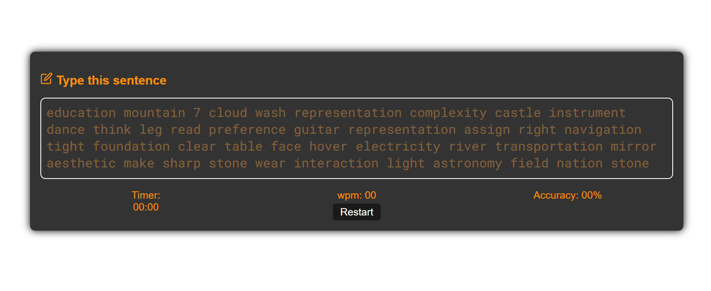

# 🖋️ Mini Typing Website

  A simple web-based typing practice tool to improve typing speed and accuracy. ✨

## ⚡ Features

  - ⌨️ Real-time typing speed (WPM) calculation

  - 🎯 Accuracy tracking

  - ⏱️ Timer functionality

  - 🔄 Restart option for new sessions

## 🚀 How to Use

  1. Clone the repository using Git:
     ```bash

     git clone https://github.com/Harsimrankaur2004/typing-website-mini-project


  3. Open index.html in your browser 🌐

  4. Start typing the displayed text ⌨️

  5. Check your WPM and accuracy 📊

  6. Click "Restart" to try again 🔄

## 🌐 Demo

  ([View Live Demo](https://typing-website-mini-project.netlify.app/))

📸 Screenshot

  

## License

This project is licensed under the MIT License.


[](https://opensource.org/licenses/MIT)
